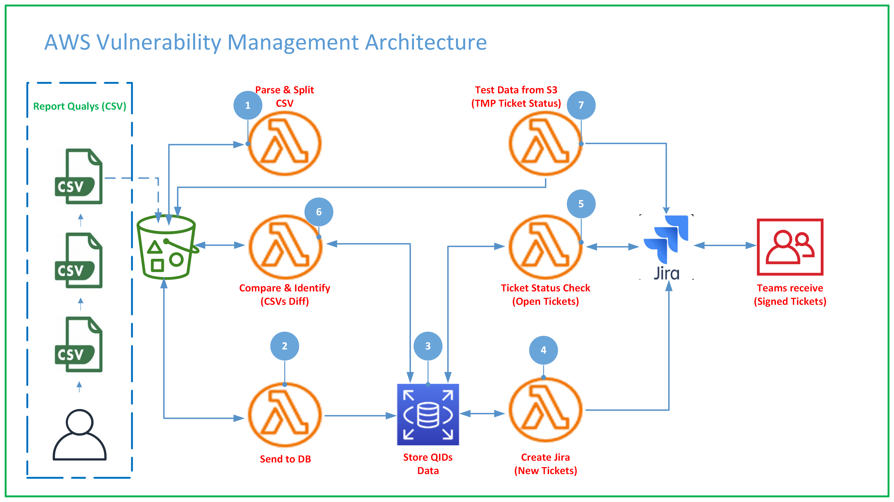

# PCI Vulnerability Management

## Overview
### The project consists of coding a solution that can deliver a system implemented in AWS Cloud that can receive a list of CVEs or better QIDs that are generated with the Qualys tool and then store the filtered columns of this ".CSV" report, send it to a relational database and then generate tickets in JIRA for the responsible teams.

## Architecture
### The architecture of the solution is composed of the following services
